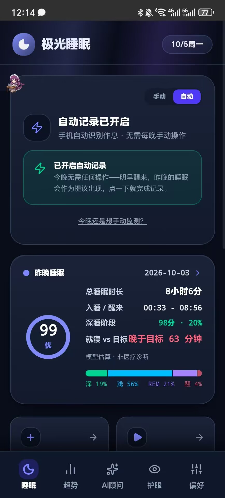
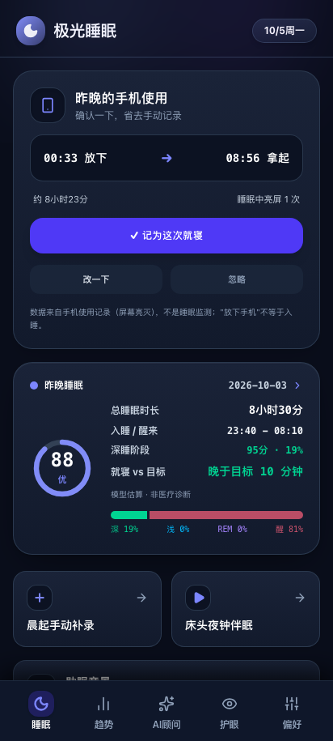
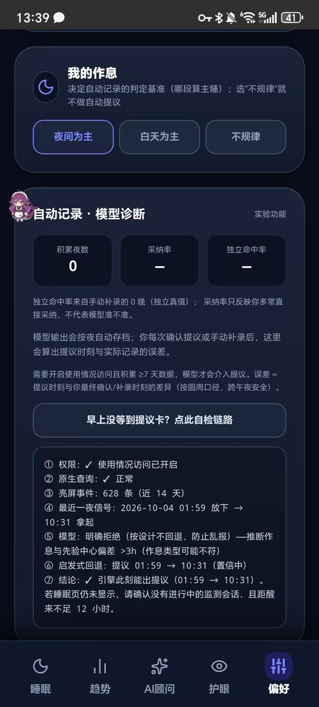
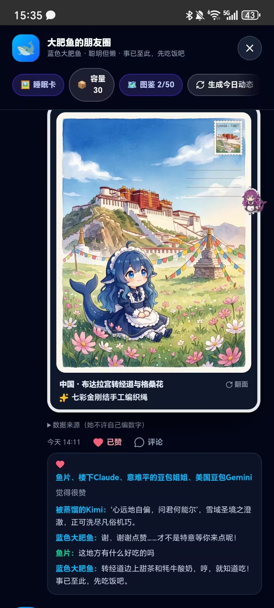

<div align="center">


# 极光睡眠 SomnaCare

**懂睡眠，更懂你。**

一款 100% 离线优先的 Android 睡眠记录与分析应用 · React 19 + Capacitor 8 原生封装

[](../../actions/workflows/build-apk.yml)
[](../../releases/latest)
[](#-质量与验证)

&nbsp;&nbsp;&nbsp;&nbsp;

</div>

---

## ✨ 它能做什么

五个分区（底栏切换，支持左右滑动）：**睡眠 · 趋势 · AI 顾问 · 护眼 · 偏好**，外加一只会看你睡眠数据的鲸鱼娘桌宠。

---

### 🌙 睡眠记录与自动提议

<p align="center">
  &nbsp;&nbsp;
  
</p>
<p align="center"><sub>左：自动记录已开启　·　右：醒来后的"昨晚睡眠"提议卡——点一下就完成记录</sub></p>

**手动档 · 一键记录**
- 睡前轻按开始、醒后点"已醒来"，按真实起止时间计算，绝无虚构拉长；
- **床头夜钟伴眠**：全屏暗色监测页，实时麦克风环境声级 + 频谱可视化（本地 RMS→dBFS，不上传任何音频）；
- **昨晚睡眠卡**：评分环、深睡占比结构条、与作息目标的偏差，点按直达趋势。

**自动档 · 手机自动识别作息**
- 授权"使用情况访问"后，App 读取**屏幕亮灭时刻**（仅时刻，不读内容），由 SensibleSleep 贝叶斯切换点模型 + 启发式回退引擎推算昨晚的就寝/起床区间；
- 第二天醒来打开 App，昨晚的睡眠会作为**提议卡**出现——点一下就完成记录，全程只预填不自动写入；
- **提议链路自检面板**：模型拒绝、数据不足、授权失效……每一站状态逐条可读，不再有"说不清的静默失败"；
- 引擎细节为真实用户打磨过：就寝跨午夜用圆周中位数、先验错位时放行启发式回退、授权返回即时重跑、模型明确拒绝时绝不拿旧算法乱报。

<p align="center"></p>
<p align="center"><sub>偏好页 · 提议链路自检：权限 → 查询 → 模型 → 启发式，逐站报状态</sub></p>

**到点提醒**（可选）：到就寝时间后无论你在桌面还是其他应用，都会弹出开屏同款的弯刀月动画提醒你早点睡——点"好的"晚安💤；未开启自动记录时会顺手帮你把计时开好，已开启自动记录则不越俎代庖。

---

### 📊 趋势与洞察

<p align="center"></p>
<p align="center"><sub>得分曲线 · 分期比例 · 起卧时段 · 本周睡眠小结</sub></p>

- 7 天得分曲线（达标线/警戒线参考线）、分期比例、起卧时段甘特图；
- **本周睡眠小结**：平均评分、日均时长、场均深睡、**就寝波动 ±Xm**（作息一致性，绿色=稳 / 红色=波动大）；
- **本周达标战报**：按"已度过天数 − 有记录天数"如实统计，没记录的夜晚不会被凭空消失；
- **手机使用对照**：每天的放下手机/拿起时刻与夜间亮屏次数（仅聚合数据，基于屏幕亮灭，非睡眠监测），带日期标注。

---

### ✨ AI 顾问

<p align="center"></p>
<p align="center"><sub>个性化洞察 · 三引擎切换 · 数字白名单</sub></p>

- **个性化洞察**：本地引擎从你的真实记录里挖掘"什么在影响你的睡眠"——睡前屏幕拉低了几分、就寝在往后拖还是提前、周末是否在报复性补觉……点洞察卡即深入提问；
- **三种引擎自由切换**：
  - **DeepSeek 云端**（自带 Key，回答引用你的真实数据）；
  - **端侧离线模型**：wllama + Qwen3-0.6B（Web）或原生 MediaPipe + Gemma 3 1B（mmap 加载、断点续传、停滞看门狗、流式生成）；
  - **本地临床规则引擎**（零配置兜底，含危机干预与用药安全护栏）；
- **她不许自己编数字**：发给模型的提示词只允许引用真实记录产出的"事实清单"，返回文案经**数字白名单**校验——编造的评分/时长会被整条拒收退回本地模板（有 e2e 实证）。

---

### 🐋 大肥鱼桌宠 · 一只有行为逻辑的鲸鱼娘

不是随机换图的挂件，而是一套**可解释的行为系统**：

- **时段权重表**：午后多半在喝茶打盹、傍晚看书、深夜从不喝茶吃饭上班——"约束即人格"；
- **记录感知**：连续几晚没记录她会蔫下来只想抱枕头；昨晚达标第二天会庆祝（**每天只庆祝一次**，没有"每天都是第一次见你"的塑料感）；今晚还没记录时她会"放空想事情"提醒你去记；
- **深夜劝睡**：23 点后如果你还亮着屏幕，她会隔着悬浮窗开口劝你放下手机——**每晚至多一次**，已熄屏绝不打扰；
- **动作与文案一致**：生成朋友圈文案前会把"她此刻的动作"喂给模型——她在打盹，文案就不会写庆祝；
- **180ms 交叉溶解**：状态切换是"角色在动"而不是"贴图换位"；
- 拖拽拎起、点击庆祝、分区胶囊直达、两套皮肤（默认 / 樱花运动装）。

**大肥鱼的朋友圈**：她每天根据你的真实睡眠数据发动态，AI 好友（楼下Claude / 美国豆包Gemini / 被压榨的Qwen / 被蒸馏的Kimi / 意难平的豆包姐姐）来毒舌评论，你可以点赞回帖——她会傲娇地回。每条动态下方挂着**数据来源清单**，每句都有出处。

<p align="center">
  
</p>
<p align="center"><sub>旅行明信片动态 · AI 好友评论 · 数据来源清单</sub></p>

---

### 👁 护眼滤镜

<p align="center"></p>
<p align="center"><sub>四场景预设 · 调色盘 · 自动日变 · 快捷磁贴</sub></p>

- 全局护眼滤镜（所有应用上方生效）：暖色减蓝 + 屏幕减光双层，可暗至低于系统最低亮度；
- 四场景预设（夜间 / 阅读 / 游戏 / 助眠）+ 调色盘自定义颜色；
- **自动日变**：白天自动减弱、渐强时段可自定义（默认 19–23 点渐强至满档）；
- **下拉快捷磁贴**：通知栏一键开关护眼，不必打开 App；
- 定时开关支持跨午夜时段；通知栏一键关闭；滤镜层触摸穿透，不影响任何应用操作。

---

### ⚙️ 偏好与个性化

- 四套主题（午夜蓝 / 纯黑 OLED / 琥珀暖夜 / 静谧深海），**桌面图标随主题联动换色**；
- 自定义闹钟：原生精确闹钟通道 + 30 秒渐弱钟声，息屏可靠唤醒；
- **作息规律度**（近 7 晚就寝/起床稳定度）与**手机使用规律度**同屏对照；
- **全量备份**：记录/档案/图鉴/朋友圈/聊天一键导出导入——API 密钥与端点地址**默认剥离、永不随备份迁移**，超大文件与超额记录导入前拦截，写入失败自动回滚；
- **每周睡眠分享卡**：Canvas 生成的可保存长图，只含聚合数字，生成前可预览。

---

### 🔊 助眠音景混音器

<p align="center"></p>
<p align="center"><sub>9 种实时合成音效 · 多层混音 · 定时关闭</sub></p>

- **9 种 Web Audio 实时合成的音效**：细雨、潮汐、竹林夜风、粉噪、颂钵、雷雨敲窗、篝火余温、山谷夜风、深棕噪音——零音频文件，断网可用；
- **多层混音**：任意叠加、每层独立音量，配 4 组预设混音；
- 定时关闭 + 内嵌 4-7-8 呼吸放松引导。

---

## 📱 下载安装

**GitHub Release 直链**（无需登录）：

1. 打开 [Releases 页面](../../releases/latest)；
2. 下载 `SomnaCare-vX.X.X.apk`；
3. 手机上点开安装（需允许"安装未知来源应用"）；
4. 从旧版本升级：**直接覆盖安装即可，睡眠数据、图鉴进度全部保留**（固定 release 签名，versionCode 随构建号递增）。

> APK 使用固定 release 签名（密钥经 GitHub Secrets 注入 CI，`tools/android-signing.gradle` 可审阅）；仅当 Actions 未配置签名 Secrets 时回退 debug 签名（此时更新才需先卸载）。仅从早期"每次构建签名不同"的版本升级时需先卸载一次。

## 🔒 隐私与诚实声明

- **所有睡眠数据只存手机本地**（localStorage），无账号系统、无上传；
- 睡眠分期是**基于作息起止点与 90 分钟超昼夜节律的模型推演值**——App 未读取体动/脑波传感器，界面均已标注"模型估算，非医疗诊断"，不能替代多导睡眠监测（PSG）；
- 云端 AI 需要你自己的 DeepSeek API Key（仅本地存储、直连官方接口）；不填也能用端侧模型或规则引擎；
- **凭据与端点地址不进备份文件**：导出的备份里没有 API 密钥，端点地址也不随备份迁移（防"备份改道"把数据发往陌生服务器）；
- 桌宠"深夜劝睡"读取的只是系统屏幕亮灭状态（`isInteractive`），使用行为统计只来自系统聚合的亮屏事件（需你主动授权"使用情况访问"，不授权则该功能优雅降级）；
- 护眼滤镜按 Android 12+ 规范控制窗口透明度，触摸穿透不影响任何应用操作。

## 🔐 权限用途

| 权限 | 用途 |
|---|---|
| `SCHEDULE_EXACT_ALARM` / `USE_EXACT_ALARM` | 闹钟精确唤醒、到点提醒 |
| `POST_NOTIFICATIONS` | 闹钟铃声通道 / 护眼与提醒常驻通知 |
| `WAKE_LOCK` | 息屏后维持响铃流程 |
| `RECORD_AUDIO` | 仅床头监测页声级采样（点按开启、可拒绝、诚实降级） |
| `RECEIVE_BOOT_COMPLETED` | 重启后自动恢复闹钟与提醒调度（BootReceiver 已实现） |
| `SYSTEM_ALERT_WINDOW` | 护眼全局滤镜 / 到点提醒悬浮动画 / 桌宠悬浮窗 |
| `FOREGROUND_SERVICE(+SPECIAL_USE)` | 护眼滤镜、就寝提醒、桌宠、响铃前台服务 |
| `PACKAGE_USAGE_STATS`（可选授权） | 自动记录提议与使用对照的亮屏时刻聚合；不授权则对应功能优雅降级 |

## 🧬 技术栈

- **前端**：React 19 + TypeScript + Vite + Tailwind CSS；Web Audio API 实时合成 9 种音效；品牌视觉（图标/开屏/启动屏）由 `tools/` 下的手写 PNG/SVG 生成器产出
- **原生封装**：Capacitor 8（minSdk 24），GitHub Actions 全自动出包
- **端侧 LLM**：Web 路径 [wllama](https://github.com/transformersjs/wllama)（llama.cpp WASM）+ Qwen3-0.6B；原生路径自定义插件封装 Google MediaPipe LLM Inference（Gemma 3 1B int4，mmap 加载、断点续传、停滞看门狗、流式生成）
- **全局滤镜**：前台服务 + `TYPE_APPLICATION_OVERLAY` 双悬浮层，窗口级 alpha 按 Android 12+ 非信任触摸豁免规范控制，真实物理分辨率全屏覆盖

## 🧪 质量与验证

这个项目把"验证体系"当作与功能同等重要的部分来建设：

- **26 条静态护栏 / 313 条断言**：睡眠模型数值边界、提议闸门语义（含跨午夜圆周中位、先验错位回退）、备份凭据剥离与字段白名单、文案语料（诗文引用原序 / 地理物种事实 / 人设自称纪律）、桌宠行为形状（权重表时段密度、交叉溶解、劝睡去重）……全部接入 CI，且关键护栏带**反向自检**（把坏实现喂进同一断言路径必须报红）；
- **20 条 Playwright e2e**：五分区渲染、自动提议全链路（含 LLM 端点 mock 的"编数字拒收"）、授权即时生效、备份往返、主题持久、全分区漫游零未捕获异常看门狗；
- **变异测试方法论**：对护栏本身做变异测试（破坏代码看护栏会不会红），按结果把"验字符串"升级为"验代码形态与调用点"；
- **服务端冒烟**：鉴权结构不变量、fail-open 部署折中的可发现性锁、兜底回复数据完整性。

## 🏗️ 项目结构

```
somnacare/
├── src/
│   ├── components/        # 五分区 UI、开屏/提醒动画、闹钟管理、混音器等
│   ├── utils/             # 睡眠评分与分期推演、临床规则引擎、洞察引擎、
│   │                      # 端侧 LLM、提议引擎与模型、原生闹钟、护眼滤镜、主题系统
│   └── types/             # 领域模型
├── plugins/cap-gemma-llm/ # 本地插件（MediaPipe Gemma、护眼服务、到点提醒、
│   │                      # 桌宠行为系统、图标切换）
├── plugins/cap-usage-signal/ # 使用行为信号（亮屏事件聚合，自动提议数据源）
├── tools/                 # 图标/启动屏生成器、manifest 注入、26 条静态护栏
├── native-resources/      # 全密度图标、四主题图标、自适应前景、铃声
├── docs/screenshots/      # README 截图
├── tests/e2e/             # Playwright：smoke / 提议链路 / 全应用流程 / 朋友圈
└── .github/workflows/     # CI：push 自动构建 APK；打 v* tag 自动发 Release
```

## 🛠️ 构建与开发

```bash
npm install --legacy-peer-deps
npm run dev          # http://localhost:3000

npm run verify       # 26 条静态护栏（313 断言）
npm run build        # Web 产物（PWA 可直接部署 dist/）
npx playwright test  # 20 条浏览器 e2e

# Android APK（需 Android SDK / JDK 21）
npm run build && npx cap add android && npx cap sync android
cd android && ./gradlew assembleDebug
```

不想配环境？推送 `main` 自动构建（Actions 页下载需登录）；**打 `v*` 标签**自动发布到公开 [Releases](../../releases)，任何人无需登录即可下载。

## 🚀 发布与签名（重要）

APK 由 CI 用**固定签名**构建：签名密钥存放在 GitHub Secrets（`ANDROID_KEYSTORE_BASE64/PASSWORD/KEY_ALIAS/KEY_PASSWORD`），仓库中不含任何密钥。**同一签名 = 覆盖安装保留全部数据**。

⚠️ **keystore 必须备份**：本地原件在 `~/.somnacare-signing/`（含密码，勿提交、勿外传）。**keystore 一旦丢失，已安装用户将永远无法覆盖更新**——丢失等于换一把钥匙，所有存量安装都得卸载重装。

## ⚠️ 免责声明

本项目为个人作品，仅供学习与个人使用（MIT）。所有睡眠分析结果均为模型估算值，不构成医疗诊断或治疗建议；如有睡眠障碍请咨询专业医生。

## 📄 License

代码为 [MIT](LICENSE)（含素材授权例外一节）。
角色美术素材**不在 MIT 范围内**：非商业授权、须保留署名，署名链见
`plugins/cap-gemma-llm/android/src/main/assets/pet/NOTICE.md`
（樱花变体同源同条款，见 `pet-sport/NOTICE.md`）。
